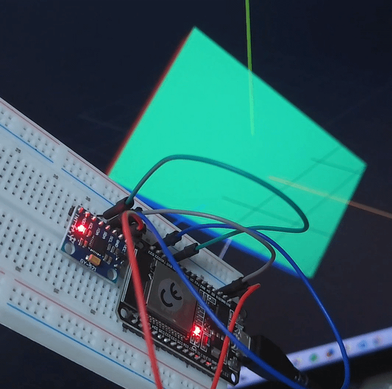

# DAY 3 학습 정리 — IMU 자세 3D 대시보드

> 목표: MPU-6050 값으로 보드의 실제 기울기(roll/pitch/yaw)를 계산하고,
> 웹 페이지의 3D 박스를 그 각도만큼 회전시켜서 "보드가 움직이는 대로 화면도 움직이는" 걸 눈으로 확인한다.
> DAY2 README의 다음 단계(상보필터 → 자세 추정 → HMI 대시보드)를 실제로 만든 것.

---

## 1. 전체 구조


```
[MPU-6050] --I2C--> [ESP32]              ESP32가 상보필터로 roll/pitch/yaw 계산
                        |
                        | USB 시리얼 (roll,pitch,yaw\n)
                        v
                 [PC: bridge/serial_to_ws.py]   시리얼을 읽어서 웹소켓으로 재전송
                        |
                        | ws://localhost:8765 (JSON)
                        v
                 [브라우저: dashboard/index.html]   Three.js로 3D 박스 회전
```

WiFi 없이 지금 있는 USB 시리얼 연결만으로 동작하도록,
"ESP32 → 시리얼 → PC 파이썬 브리지 → 웹소켓 → 브라우저" 구조로 만들었다.

---

## 2. 배선

DAY2와 동일 (MPU-6050 4선 I2C 연결). [DAY2_MPU6050 README](../DAY2_MPU6050/README.md) 참고.

---

## 3. ESP32 쪽 — 상보필터 (Complementary Filter)

가속도계와 자이로는 서로 잘하는 게 다르다.

| | 장점 | 단점 |
|---|---|---|
| 가속도계 | 중력 방향 기준이라 **장기적으로 안정적** (drift 없음) | 흔들리거나 움직이면 **순간 노이즈**가 큼 |
| 자이로 | **반응이 빠르고 부드러움** | 계속 더해나가는 적분값이라 **시간이 지나면 서서히 틀어짐(drift)** |

그래서 둘을 섞는다: 짧은 시간은 자이로(부드러움)를 믿고, 긴 시간은 가속도(안정성)로 보정한다.

```cpp
roll  = ALPHA * (roll  + gx * dt) + (1 - ALPHA) * rollAcc;
pitch = ALPHA * (pitch + gy * dt) + (1 - ALPHA) * pitchAcc;
```

- `ALPHA`(0.96)가 클수록 자이로를 더 믿음 → drift는 줄지만 반응이 느려짐
- `ALPHA`가 작을수록 가속도를 더 믿음 → 반응은 빠르지만 흔들림에 약함
- `yaw`는 지자기(나침반) 센서가 없어서 자이로 적분만 가능 → **참고용**, 오래 두면 서서히 틀어짐

### 3-1. 가속도 크기(accMag) 게이팅 — 빠르게 움직일 때 값이 튀는 문제 보정

가속도계는 "중력 방향"만 재는 게 아니라 실제 움직임의 가속도까지 같이 잰다.
그래서 보드를 휙 뒤집으면 그 순간의 `rollAcc`/`pitchAcc`가 완전히 엉뚱한 값이 되고,
`ALPHA`가 커도 그 오차가 매 프레임 조금씩 섞여 들어가 화면이 튄다.

정지 상태에서는 가속도 3축의 크기(`sqrt(ax²+ay²+az²)`)가 항상 중력 1g에 가깝다는 걸 이용해서,
1g에서 많이 벗어나면(=지금 움직이는 중) 그 순간만 가속도 보정 비중을 0으로 낮춘다.

```cpp
float accMag = sqrt(ax * ax + ay * ay + az * az);
float accelWeight = (fabs(accMag - 1.0f) < 0.2f) ? (1 - ALPHA) : 0.0f;

roll  = (roll  + gx * dt) * (1 - accelWeight) + rollAcc  * accelWeight;
pitch = (pitch + gy * dt) * (1 - accelWeight) + pitchAcc * accelWeight;
```

- 정적일 때(`accMag ≈ 1.0`): 기존 상보필터와 동일하게 동작
- 빠르게 움직일 때(`accMag`이 1g에서 크게 벗어남): 그 순간은 자이로 적분값만 사용 → 튀는 현상 감소
- 다만 roll이 ±180°를 넘나드는 순간의 점프는 별개 원인(오일러 각의 구조적 한계, atan2 wraparound)이라 이 방법으로는 안 없어짐 → 7번 다음 단계의 쿼터니언 전환으로 해결 가능

### 3-2. 상보필터 vs 칼만필터

둘 다 "가속도(안정적) + 자이로(부드러움)를 섞는다"는 목적은 같지만 방식이 다르다.

| | 상보필터 (지금 방식) | 칼만필터 |
|---|---|---|
| 섞는 비율 | `ALPHA` 같은 **고정값**을 사람이 손으로 튜닝 | 센서 노이즈(분산)를 기반으로 **매 순간 최적 비율을 스스로 계산** |
| 계산량 | 가벼움 (곱셈/덧셈) | 무거움 (행렬 연산) |

사실 칼만필터를 아주 단순한 1축 문제에 계속 돌리면 게인이 결국 하나의 고정값으로 수렴하는데,
그 상태가 수학적으로 상보필터와 거의 같아진다 — **상보필터는 칼만필터의 "고정 게인" 버전**이라고 볼 수 있다.

가속도로 각도를 구하는 공식(정지 상태 기준):

```cpp
rollAcc  = atan2(ay, az) * 180/PI;
pitchAcc = atan2(-ax, sqrt(ay*ay + az*az)) * 180/PI;
```

계산한 `roll,pitch,yaw`를 50Hz(20ms 간격)로 시리얼에 CSV 한 줄로 출력한다.

---

## 4. 실행 방법

### 4-1. ESP32에 펌웨어 업로드

```bash
pio run --target upload
```

업로드 후에는 **모니터를 열어두지 말 것** — 아래 파이썬 브리지가 같은 COM 포트를 사용해야 한다
(하나의 COM 포트는 동시에 한 프로그램만 사용 가능, DAY1 참고).

### 4-2. 파이썬 브리지 실행

```bash
cd bridge
pip install -r requirements.txt
python serial_to_ws.py --port COM7
```

`--port`는 본인 환경의 COM 번호로 변경. 정상이면 아래처럼 뜬다.

```
[bridge] 웹소켓 서버 시작: ws://localhost:8765
[bridge] 시리얼 연결: COM7 @ 115200bps
```

이후 데이터가 들어오기 시작하면 아래처럼 디버그 로그가 찍힌다. 문제가 생기면 여기서부터 확인.

```
[bridge] 원본 수신: '12.34,-5.67,0.89'     # 처음 5줄만 원본 그대로 출력
[bridge] 전송중 roll=12.3 pitch=-5.7 yaw=0.9 (누적 1234줄, 구독자 1명)   # 1초마다
```

- `형식 불일치` 로그만 계속 뜬다 → 시리얼로 들어오는 문자열이 `roll,pitch,yaw` 형식이 아님.
  대부분 **DAY2 펌웨어가 아직 그대로 올라가 있는 경우**(`가속도(g) X:...` 텍스트가 찍힘).
  DAY3 폴더에서 `pio run --target upload`로 다시 업로드하면 해결.
- 아무 로그도 안 뜬다 → 시리얼로 아무것도 안 들어오는 것. 배선/보드 리셋 확인.
- `전송중`은 뜨는데 `구독자 0명` → 브리지는 정상, 브라우저가 안 붙어있는 것 (대시보드 새로고침).

### 4-3. 대시보드 열기

`dashboard/index.html`을 브라우저(Chrome/Edge)로 더블클릭해서 열기.
우측 상단에 "연결됨"이 뜨고, 보드를 기울이면 3D 박스가 같이 기운다.

---

## 5. 축이 반대로 도는 경우 (캘리브레이션)

센서를 어떤 방향으로 붙였는지에 따라 실제 보드와 화면 속 박스가 **반대로** 돌 수 있다.
그럴 때는 `dashboard/index.html` 안의 부호만 바꾸면 된다.

```js
const AXIS_SIGN = { roll: 1, pitch: 1, yaw: 1 };
// 반대로 돌면 해당 값을 -1로
```

박스는 면마다 색이 달라서(빨강=X, 초록=Y, 파랑=Z) 어느 축이 어떻게 도는지 구분하기 쉽게 만들었다.
흰색 화살표는 "정면"(USB 커넥터 쪽이라고 가정) 방향 표시.

---

## 6. 디버깅에서 배운 것

| 증상 | 원인 | 해결 |
|---|---|---|
| 대시보드에 "연결 끊김"만 뜸 | 브리지 스크립트를 먼저 안 켰거나 종료됨 | `serial_to_ws.py` 실행 상태 확인 |
| 업로드 시 `Could not open COM7` / `PermissionError` | 브리지 스크립트나 시리얼 모니터가 이미 그 COM 포트를 잡고 있음 | 작업관리자(또는 `tasklist`)에서 해당 `python.exe`/모니터 프로세스 종료 후 재시도 |
| 브리지 로그에 `형식 불일치`만 계속 뜸 | 보드에 DAY2 펌웨어가 그대로 올라가 있어서 출력 형식이 다름 | DAY3 폴더에서 `pio run --target upload` 다시 실행 |
| 박스가 뚝뚝 끊기며 움직임 | 시리얼 전송 주기가 너무 김 | `main.cpp`의 `delay(20)` 값 확인 (짧을수록 부드러움) |
| 박스가 반대 방향으로 회전 | 센서 부착 방향과 좌표축 방향 불일치 | 위 5번 `AXIS_SIGN` 부호 조정 |
| 보드를 휙 뒤집으면 값이 크게 튐 | 가속도계가 중력뿐 아니라 움직임 자체의 가속도까지 같이 잼 (상보필터의 구조적 한계) | 3-1번 `accMag` 게이팅 적용 (완료) |
| 가만히 둬도 yaw가 계속 증가 | 자이로 drift (지자기 센서 없음) | 정상 현상. 절대 방향이 필요하면 지자기 센서(compass) 추가 필요 |

---

## 7. 다음 단계

- [ ] 지자기 센서(HMC5883L 등) 추가해서 yaw drift 없애기 (AHRS)
- [ ] 상보필터 대신 **칼만필터**로 바꿔서 비교해보기
- [ ] WiFi로 전환해서 PC 브리지 없이 ESP32가 직접 대시보드 서빙하기
- [ ] 여러 축 동시에 여러 보드(다중 센서) 비교하는 화면으로 확장
- [ ] (아래 8번) 이벤트 기반 "블랙박스" 로깅 구현

---

## 8. (아이디어 메모) 이벤트 기반 블랙박스 로깅 — 아직 구현 안 함

**질문에서 출발**: "지금 이렇게 데이터가 계속 쌓이는데, 이걸 DB에 다 저장하면 낭비 아닌가?"

### 왜 필요한가 — 실제로 "기록을 남겨서 나중에 보는" 사례들

- **드론/로봇 비행 로그**: 추락하거나 이상 동작하면 그 순간 자세가 어떻게 틀어졌는지 사후 분석
- **차량 블랙박스 / 보험 텔레매틱스**: 급제동·급회전·사고 순간의 IMU로 사고 재구성, 운전 습관 평가
- **낙상 감지 웨어러블**: 급격한 가속도/자이로 변화 = 낙상 이벤트로 판단, 그 앞뒤 구간만 저장해 의료진이 확인
- **스포츠 동작 분석 / 모션 캡처**: 스윙·투구 동작을 기록했다가 리플레이하며 분석
- **설비 예지보전**: 진동 패턴 추세를 장기간 기록해서 고장 전에 이상 징후 포착

공통점: **평소엔 저장 안 하고, "의미 있는 순간"만 저장한다.**

### 설계 방향 (링 버퍼 + 이벤트 트리거)

```
[메모리 링 버퍼] 최근 N초치 (roll,pitch,yaw)만 계속 덮어쓰며 보관 — 디스크에 안 씀
        │
        │ 프레임 간 각도 변화량이 임계값을 넘음 (= 급격한 움직임 감지, "트리거")
        ▼
[트리거 시점 앞뒤 몇 초]만 통째로 SQLite 같은 DB에 저장
```

- 트리거 조건(안): 한 샘플과 그 다음 샘플 사이 `|roll 변화| + |pitch 변화|`가 임계값(예: 6°)을 넘으면 이벤트로 판단
- 저장 범위: 트리거 **이전** N초(링 버퍼에 이미 있던 것) + 트리거 **이후** M초를 한 이벤트로 묶어서 저장
- 이벤트 도중에 또 트리거가 걸리면 종료 시점을 뒤로 늘려서, 연속 동작을 이벤트 하나로 합침 (이벤트가 잘게 쪼개지는 것 방지)
- DB 스키마(안): `events`(이벤트 1건당 1행: 시각/최대변화량/샘플수) + `readings`(이벤트에 속한 개별 샘플들, 이벤트 기준 상대시간(ms) 포함)
- 이 방식이면 가만히 두는 시간이 대부분인 평소엔 DB가 거의 안 자라고, "움직인 순간"만 쌓이므로 30-3번에서 걱정했던 "무한정 쌓이는 문제"가 해결됨

### 어디에 붙일까

지금 구조에서 `roll,pitch,yaw`를 매 줄 파싱하고 있는 곳이 `bridge/serial_to_ws.py`의 `read_serial_loop`이므로,
여기에 이벤트 로거를 하나 더 붙이는 게 가장 자연스러움 (ESP32 펌웨어나 대시보드는 안 건드려도 됨).

### TODO (다음에 실제로 만들 것)

- [ ] `bridge/`에 이벤트 로거 모듈 추가 (링 버퍼 + 트리거 감지 + SQLite 저장)
- [ ] 저장된 이벤트 목록/샘플을 조회하는 간단한 스크립트
- [ ] 트리거 임계값(`6°` 등)이 적절한지 실제 보드로 테스트하며 튜닝
- [ ] (선택) 대시보드에 "최근 이벤트 목록" 패널 추가해서 클릭하면 그 구간 리플레이
